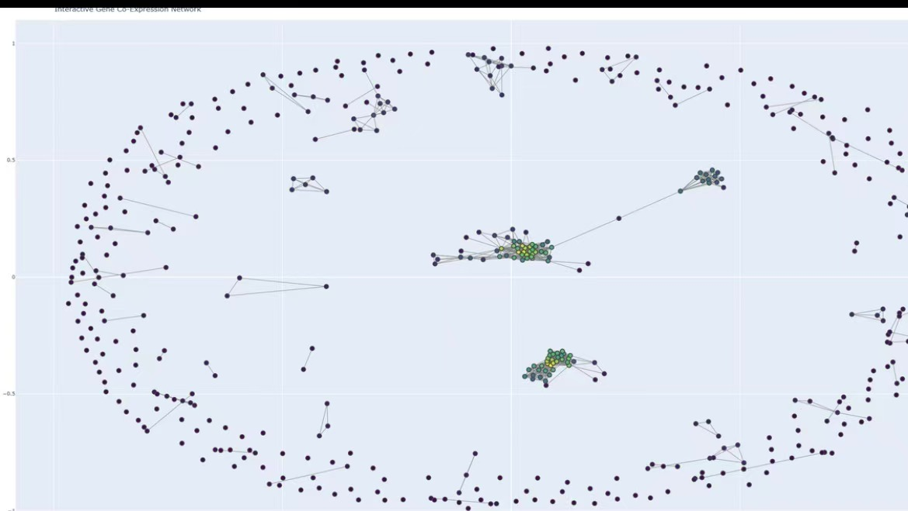

# Breast Cancer Gene Co-Expression Network Analysis

Graph-based analysis of breast cancer gene expression data to identify hub genes and communities using NetworkX.

---



---

## Table of Contents

- [Overview](#overview)
- [Technologies Used](#technologies-used)
- [Project Structure](#project-structure)
- [Installation](#installation)
- [Running the Project](#running-the-project)
- [Methods](#methods)
- [Dataset](#dataset)
- [Future Improvements](#future-improvements)
- [Author](#author)

---

## Overview

This project analyzes breast cancer gene expression data to construct a **gene co-expression network** using graph-based methods.

Genes are represented as nodes in a graph, and edges represent strong correlations between gene expression levels. By analyzing the structure of this network, the program identifies:

- **Hub genes** with high connectivity
- **Gene communities** using graph community detection algorithms
- Patterns that may help understand gene relationships in breast cancer data

The project demonstrates how **network science and data analysis techniques** can be applied to biological datasets.

---


## Technologies Used

- Python
- pandas
- numpy
- networkx
- matplotlib
- plotly
- scipy

---

## Project Structure

```
breast-cancer-gene-network-analysis
│
├── README.md
├── requirements.txt
├── project.ipynb
├── result.jpg
└── project_report.pdf
```

---

## Installation

Install required Python packages:
    
```bash
pip install -r requirements.txt
```

---

## Running the Project

Open the Jupyter Notebook:

```bash
jupyter notebook project.ipynb
```

Run all cells to reproduce the analysis and visualization.

---

## Methods

The analysis pipeline includes the following steps:

1. **Data Loading**
   - Gene expression data is loaded using pandas

2. **Data Preprocessing**
   - Filtering genes with high expression variance

3. **Correlation Calculation**
   - Pearson correlation coefficients are computed between gene pairs

4. **Graph Construction**
   - Genes are treated as nodes
   - Edges are created when correlation exceeds a chosen threshold

5. **Community Detection**
   - The **Girvan-Newman algorithm** is applied to identify gene communities

6. **Centrality Analysis**
   - Degree and betweenness centrality are used to identify hub genes

7. **Network Visualization**
   - The gene network is visualized using graph layout algorithms


---

## Dataset

The dataset used in this project is derived from **breast cancer gene expression data (TCGA)**.

Each row represents a patient sample and each column represents gene expression levels.

---

## Future Improvements

Possible future improvements include:

- Automatic threshold selection for edge creation
- Comparison between healthy and cancer samples
- Integration with biological pathway databases
- Improved visualization techniques for large gene networks

---

## Author

Muzhe Xu  
University of Toronto
